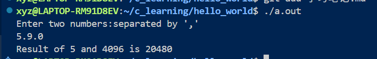
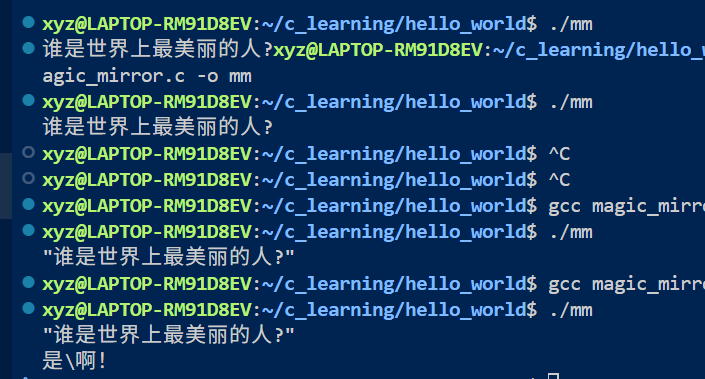
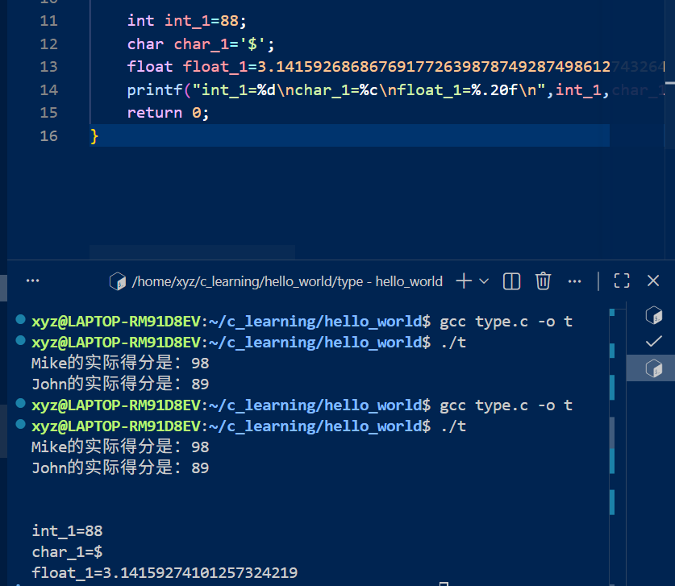

8.2
占位符	 对应的数据类型	                 简单示例
%d	    int (有符号整数)	            printf("%d", 10);
%f	    float / double (浮点数/小数)    printf("%f", 3.14);
%c	    char (单个字符)	                printf("%c", 'A');
%s	    char[] (字符串/字符数组)	     printf("%s", "你好");
“，”后面加变量名也是可以的

使用内置函数printf()之前要声明#include <stdio.h>头文件。
scanf()函数用于从键盘接收数据。
gcc 文件名 -o 启动指令  [编译]   ./启动指令[运行]（a.out是默认的启动指令）
Q:return 0;又没有真的在终端打印0出来怎么用return 0;判断执行状态的呢？

git add "文件名" ; git commit -m "注释" ; git push

C语言里没有直接的幂方运算，可以使用pow()函数。
function_main.c里面有趣的运算结果：；

8.8
魔镜：  #include（编译之前包含某文件）
        <stdio.h> stdio （输出输入库）；“.h”后缀的文件是头文件
printf( f是formatted 格式化的意思)
希望printf打印出(你好“你好”)这样包含双引号的内容时，需要用转义字符\，用\"来表示单纯的双引号。
各类转义符：
\n 换行；\t 制表符；\r 回车；\\ 反斜杠；\" 双引号；\' 单引号；\? 问号；\a 响铃；\b 退格；\f 换页；\v 垂直制表符；\0 空字符

整数 integer (int) 
浮点数 float/double 
字符 char ASCII码 
字符串 string 
数组 array 
结构体 struct 
共用体 union 
枚举 enum 
指针 pointer 
函数 function 
宏 macro 
浮点型似乎有着非常奇怪的精度
