8.2
占位符	 对应的数据类型	                 简单示例
%d	    int (有符号整数)	            printf("%d", 10);
%f	    float / double (浮点数/小数)    printf("%f", 3.14);
%c	    char (单个字符)	                printf("%c", 'A');
%s	    char[] (字符串/字符数组)	     printf("%s", "你好");
“，”后面加变量名也是可以的

使用内置函数printf()之前要声明#include <stdio.h>头文件。
scanf()函数用于从键盘接收数据。
gcc 文件名 -o 启动指令  [编译]   ./启动指令[运行]（a.out是默认的启动指令）
Q:return 0;又没有真的在终端打印0出来怎么用return 0;判断执行状态的呢？

git add "文件名" ; git commit -m "注释" ; git push

C语言里没有直接的幂方运算，可以使用pow()函数。
function_main.c里面有趣的运算结果：!
[alt text](image.png)；

8.8
魔镜：  #include（编译之前包含某文件）
        <stdio.h> stdio （输出输入库）；“.h”后缀的文件是头文件
printf( f是formatted 格式化的意思)
希望printf打印出(你好“你好”)这样包含双引号的内容时，需要用转义字符\，用\"来表示单纯的双引号。
各类转义符：
\n 换行；\t 制表符；\r 回车；\\ 反斜杠；\" 双引号；\' 单引号；\? 问号；\a 响铃；\b 退格；\f 换页；\v 垂直制表符；\0 空字符

整数 integer (int) 
浮点数 float/double 
字符 char ASCII码 
字符串 string 
数组 array 
结构体 struct 
共用体 union 
枚举 enum 
指针 pointer 
函数 function 
宏 macro 

浮点型似乎有着非常奇怪的精度
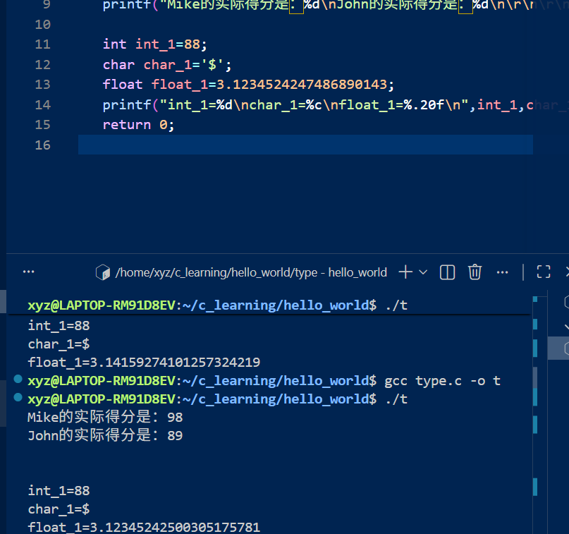
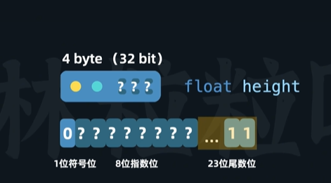
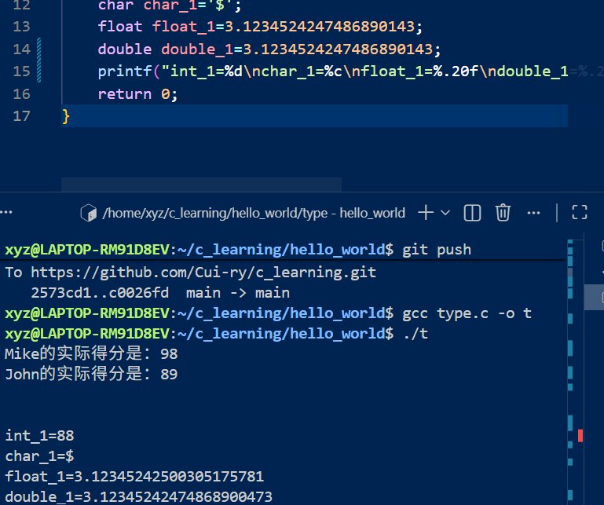
双精度会好一点但也没好到哪里去？（这是因为十进制的数实际是转换成2进制计算的，但很多小数转换为2进制是会是循环小数，只能取它的近似值来计算）

10%3=1  余数为1，符号和%前的数字一致
10%-3=1 余数为1，符号和%前的数字一致
-10%3=-1 余数为-1，符号和%前的数字一致

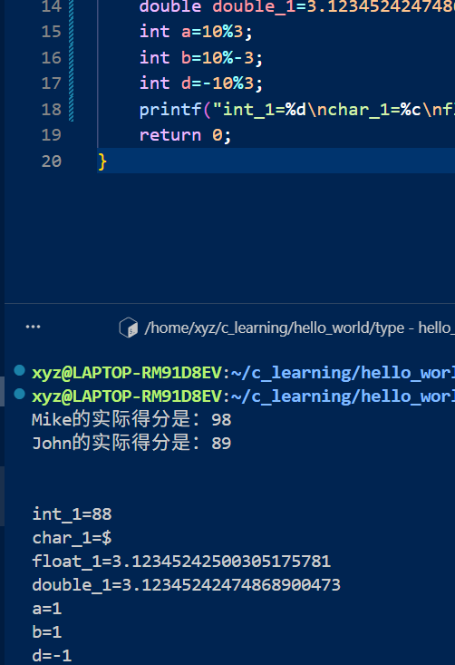

#include <math.h>包括高阶的数学运算函数，如pow()，sqrt()，sin()等
出现报错：
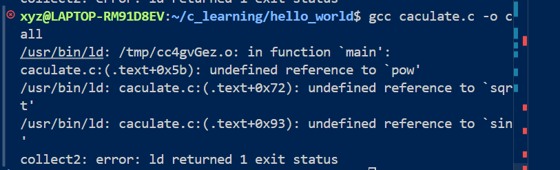
解决方法：在编译时加上-lm参数，例如gcc -o main main.c -lm

8.9
const声明常量   常量名一般会所有字母都大写
//当行注释
/*多行注释*/

判断：
if (条件) {条件为真时执行的代码内容}
else if (条件) {条件为真时执行的代码内容}
else {条件为假时执行的代码内容}条件判断从上到下从外向内判断
bool类型：true/false    需要头文件#include <stdbool.h>
c语言里面的比较符号和python一样一样的

switch (表达式) {
        case 常量1:
            语句;
            break; //跳出switch结构，防止执行到下一个case
        case 常量2:
            语句;
            break;
        default:
            默认执行的代码内容;
}

循环：
for (初始化表达式; 条件判断; 更新表达式) {
    循环体;
}
while (条件) {
    循环体;
}
do {
    循环体;
} while (条件);两者的区别是先判断在执行还是先执行再判断
break: 直接跳出循环结构，不再执行后续的代码内容
continue: 直接跳过本次循环的剩余部分，直接进入第二次循环
什么叫做可以被隐式转换为整型的类型？
为什么注释掉“break”后会导致这种情况呢？
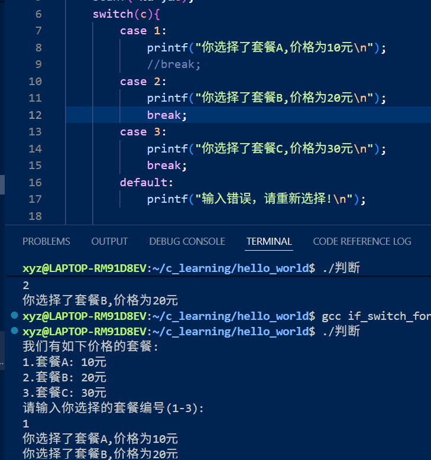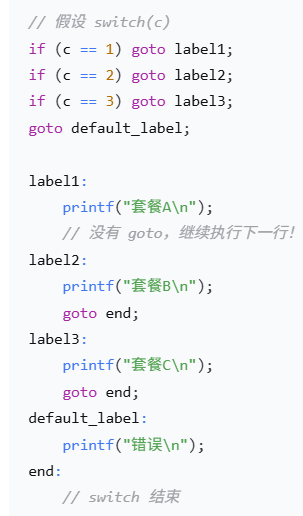

if_switch_for_while.c的练习题：
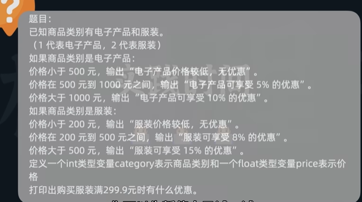

git add .; git commit -m "注释"; git push origin main
逻辑运算符和关系运算符：
与：&&   ；   或:||   ;    非：！

scanf("格式字符串"，变量地址1，变量地址2，...)
&取地址符：获取指定变量的地址
换行信息，空格，“，”都会被设置为字符串，输入要注意格式
占位符前加一个空格，表示忽略所有输入的空白字符类似于：
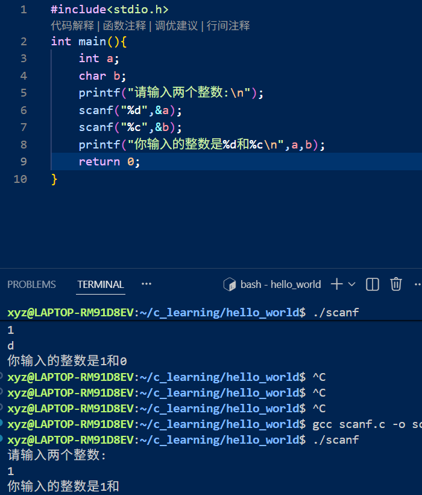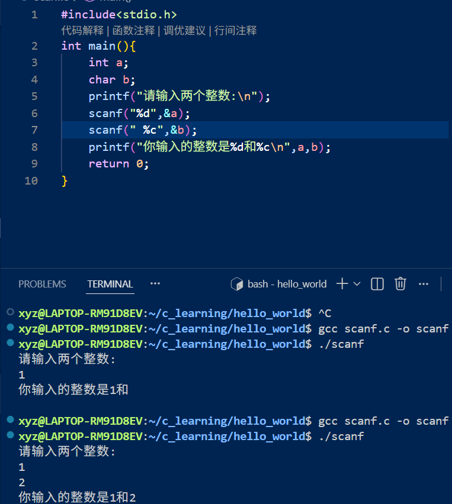
数组：数据类型 数组名[元素个数]={...}
若元素个数为“ ”则程序根据花括号里的元素个数自动计算
数组名[索引值]：索引值从0开始   一般利用for循环处理数组

字符串： char 字符串名[字符个数+1]={...,\0}；   char 字符串名[字符个数+1]=“...”（这种形式写的字符串程序会自动在末尾添加\0空字符）
数组名用scanf赋值的时候不用加&符号 e.g. scanf("%9s",arr);限制读取字符数量 
在读取scanf输入值时遇到空格会导致读取停止

8.10
指针：和内存密切相关，内存被化为小的单元，每个单元占一个字节（8bit）都有一个地址,指针就是用来存放地址的变量,我们可以利用指针变量储存某个变量的内存地址，并通过这个内存地址来访问该变量。
指针变量命名的一般格式： 数据类型* 指针名 用于定义指针变量   ；数据类型 *指针名 此处的*是解引用运算符 用于找到指针指向的变量的值，可以修改指针指向的变量的值
利用“&”可以找到变量的地址
NULL指针：指向空地址的指针，通常用来表示一个不存在的内存位置

单字符 char ch='A'   字符串 char* c="A"
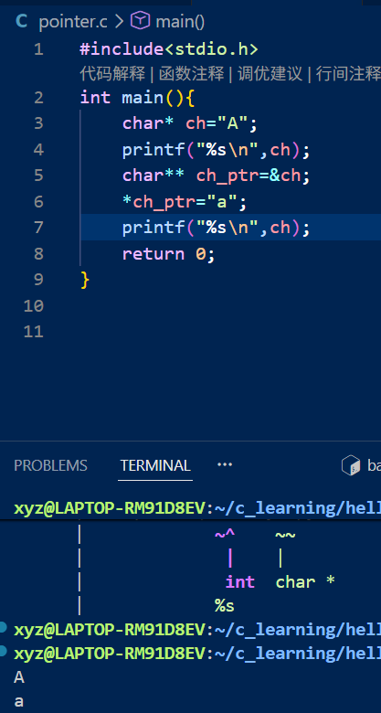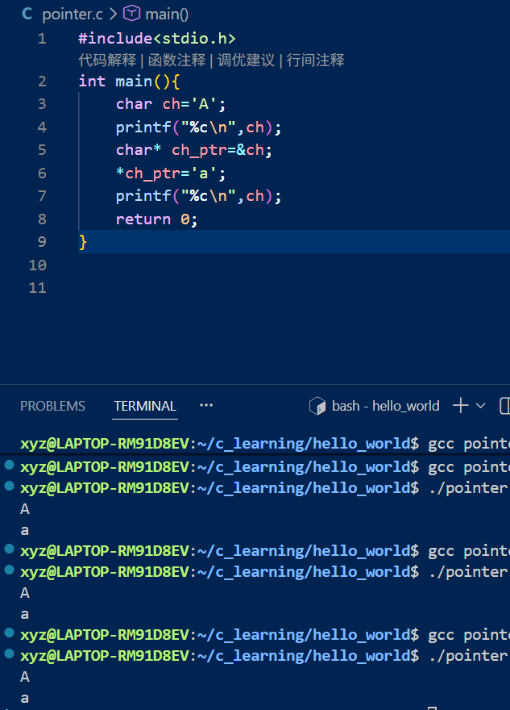
